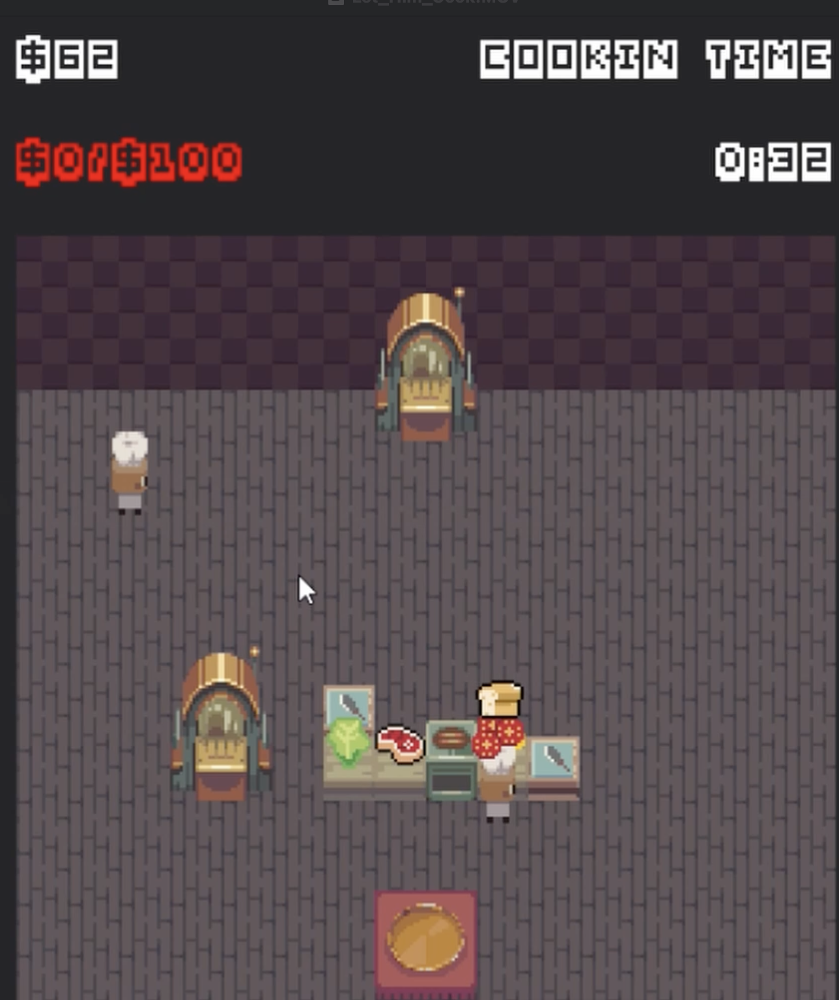
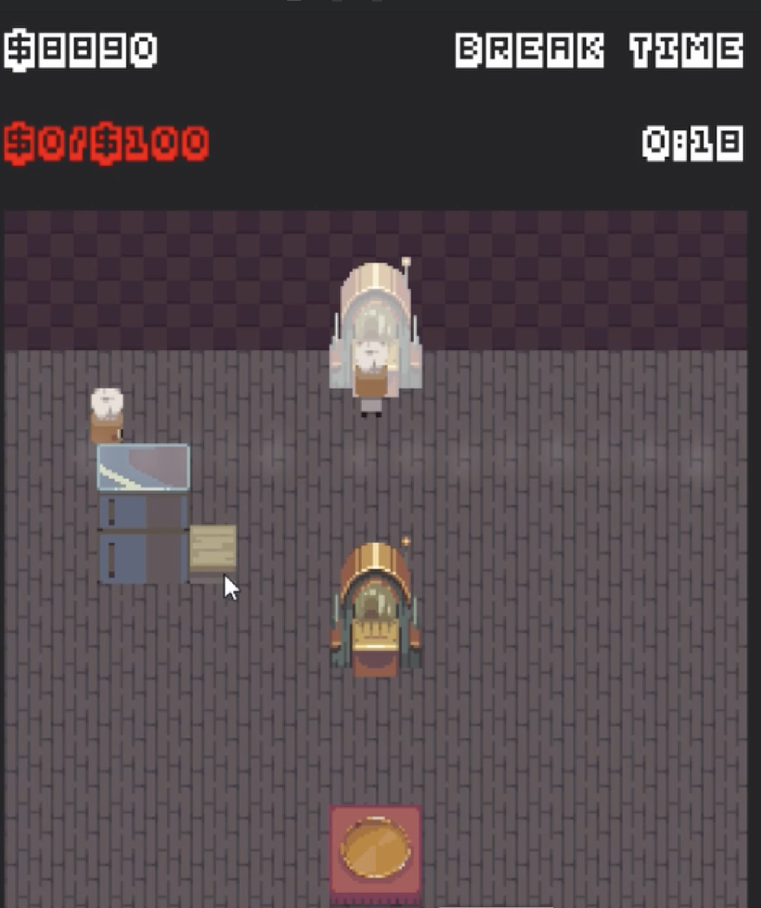
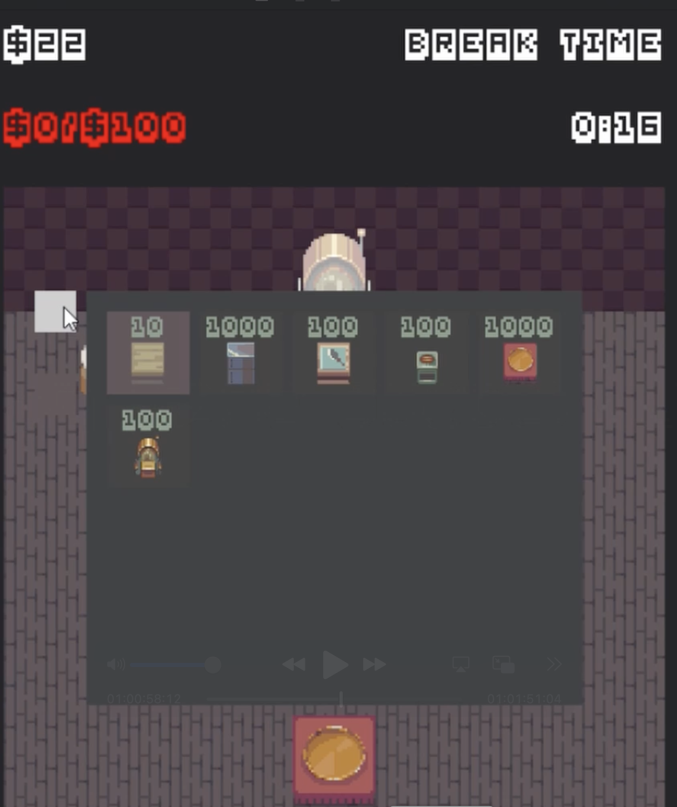
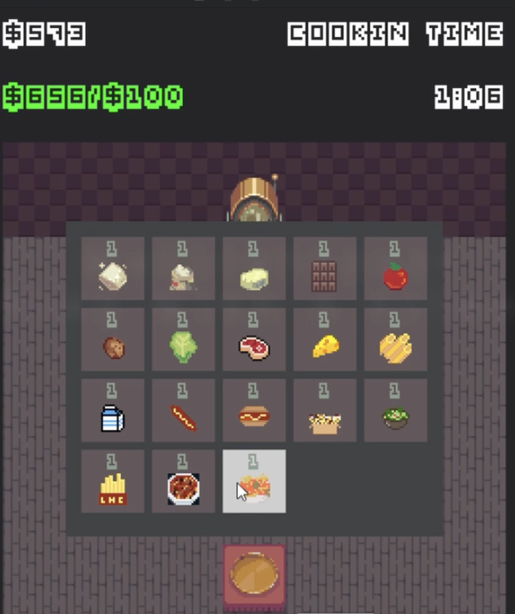
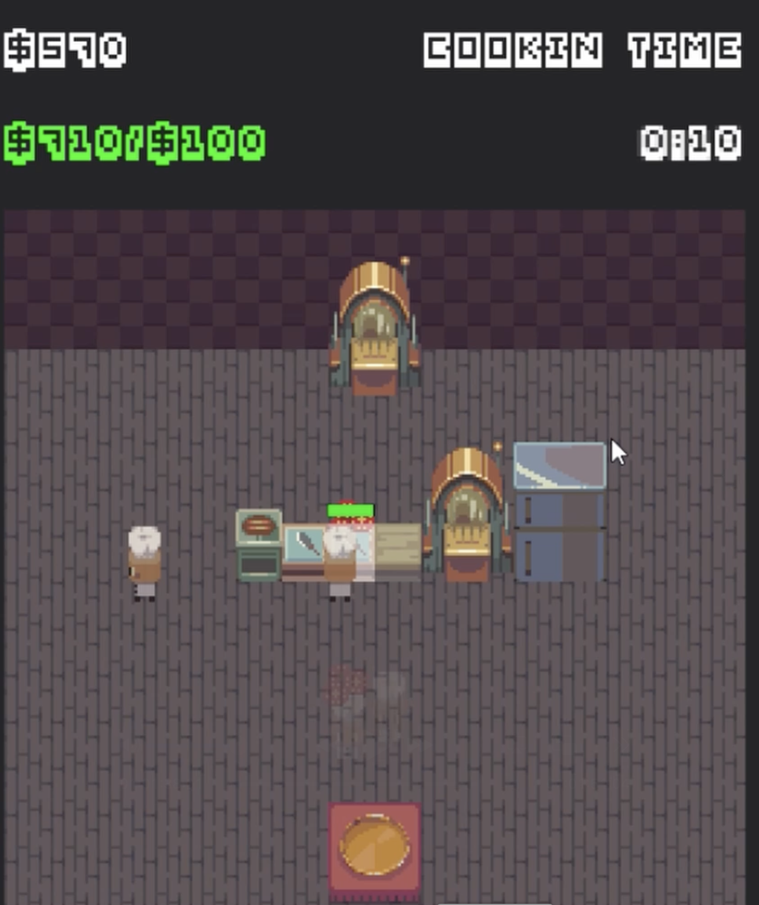

# Let Him Cook 🍳

A fun cooking simulation game where you manage a kitchen, prepare ingredients, and serve customers! Take on the role of a chef and see how many orders you can complete.

## 🎮 Game Overview

"Let Him Cook" is a pixel-art cooking game where players manage a kitchen workspace, interact with various cooking stations, and prepare delicious meals for customers. The game features a day/night cycle with cooking waves and break periods.

## 🚀 Features

- **Kitchen Management**: Build and place various cooking stations
- **Ingredient System**: Collect, combine, and process ingredients
- **Recipe Crafting**: Create complex dishes by combining ingredients
- **Building System**: Purchase and place new kitchen equipment
- **Day/Night Cycle**: Manage your kitchen during cooking and break waves
- **Customer Service**: Sell completed dishes for profit
- **Inventory Management**: Limited inventory space adds strategic depth

## 🎯 How to Play

### Controls
- **WASD** or **Arrow Keys**: Move your character
- **E**: Interact with buildings (place items, open menus)
- **Q** or **Right Ctrl**: Pick up items from buildings
- **Space**: Add random ingredients to inventory (debug feature)
- **Escape**: Pause game or return to previous menu

### Gameplay Loop
1. **Break Wave**: Purchase new buildings and ingredients
2. **Cooking Wave**: Serve customers and complete orders
3. **Manage Resources**: Balance money, inventory space, and customer demands

### Cooking Stations

#### Counter
- **Place Items**: Drop ingredients to create packages
- **Pick Up**: Retrieve items when inventory has space
- **Recipe Creation**: Combine ingredients to form new dishes

#### Processor (Chopper/Oven)
- **Chopper**: Cuts ingredients (e.g., potato → potato slices)
- **Oven**: Bakes ingredients (e.g., cookie batter → cookie)
- **Progress System**: Items take time to process

#### Fridge
- **Storage**: Holds up to 20 items
- **Pre-filled**: Comes with random ingredients
- **Access**: Open during break waves

#### Seller
- **Sell Items**: Convert completed dishes to money
- **Wave Restriction**: Only active during cooking waves

## 🏗️ Building System

### Available Buildings
- **Counter** ($10): Basic food preparation station
- **Fridge** ($1000): Ingredient storage
- **Chopper** ($100): Cuts ingredients
- **Oven** ($100): Bakes ingredients
- **Seller** ($1000): Sells completed dishes
- **Item Shop** ($100): Purchase ingredients

### Building Placement
- Buildings can be placed on empty tiles
- Some buildings have larger footprints
- Buildings are solid and block movement

## 🥘 Recipe System

### Counter Recipes
- **Cookie Batter**: Sugar + Flour + Chocolate + Butter
- **Burger**: Bread + Meat + Lettuce
- **Supreme Burger**: Bread + Meat + Lettuce + Cheese + Tomato Slice
- **Poutine**: Fries + Meat + Cheese
- **Chili**: Tomato Slice + Milk + Meat + Cheese
- **Hot Dog**: Weiner + Bread
- **Salad**: Tomato Slice + Lettuce + Cheese
- **Ice Cream**: Milk + Sugar + Chocolate

### Oven Recipes
- **Cookie**: Cookie Batter
- **Bread**: Flour + Sugar + Milk + Butter
- **Fries**: Potato Slices
- **Spaghetti Meatballs**: Tomato Slice + Pasta + Meat
- **Cake**: Flour + Milk + Sugar + Chocolate

### Chopper Recipes
- **Potato Slices**: Potato
- **Tomato Slice**: Tomato

## 💰 Economy

- **Starting Money**: $500
- **Income**: Sell completed dishes to customers
- **Expenses**: Purchase buildings and ingredients
- **Profit**: Balance customer demand with resource costs

## 🎨 Technical Details

### Built With
- **Python 3.x**
- **Pygame**: Game engine and graphics
- **Pixel Art**: Custom sprites and animations

### Project Structure
```
Let-Him-Cook/
├── main.py              # Main game entry point
├── game.py              # Core game logic
├── player.py            # Player character and controls
├── world.py             # World generation and buildings
├── items.py             # Item and inventory system
├── userinterface.py     # UI components and menus
├── worldEditor.py       # Building placement system
├── sprites/             # Game sprites and textures
├── sounds/              # Audio files
├── fonts/               # Custom fonts
└── tests/               # Unit tests
```

## 🧪 Testing

The project includes comprehensive unit tests for core mechanics:

```bash
# Run all tests
python3 -m unittest discover -s tests -p 'test_*.py' -v

# Run specific test file
python3 -m unittest tests.test_pickup_drop -v
```

### Test Coverage
- **Pickup Mechanics**: Testing item retrieval from buildings
- **Drop Mechanics**: Testing item placement on cooking stations
- **Inventory Management**: Testing capacity limits and item handling
- **Building Interactions**: Testing various cooking station behaviors

## 🎥 Video Demonstration

### Devpost Project: Let Him Cook - A Multiplayer Kitchen Management Adventure

**Project Overview:**
"Let Him Cook" is an innovative multiplayer cooking simulation game that combines strategic kitchen management with real-time culinary challenges. Players work together (or compete) to build, manage, and optimize their kitchen operations while serving customers under time pressure.

### 🎯 Core Gameplay Features

#### 1. **Stack Food & Create Dishes Using Built-in Recipes Within Cooking Time**
- **Real-time Cooking System**: Players must efficiently stack ingredients and create dishes using built-in recipes while racing against the clock
- **Recipe Management**: Comprehensive recipe system with ingredients like meat, tomato, lettuce, cheese, and more
- **Time Pressure**: "COOKIN TIME" countdown creates intense, engaging gameplay where every second counts
- **Ingredient Combination**: Strategic stacking of ingredients at various cooking stations to maximize efficiency

#### 2. **Customizable Kitchen Building System**
- **Freedom of Design**: Players can build their kitchen exactly how they want with complete freedom of placement
- **Modular Construction**: Various building types including counters, processors, storage units, and decorative elements
- **Strategic Layout**: Optimize kitchen flow for maximum efficiency and customer satisfaction
- **Building Categories**: From basic counters ($10) to advanced processors ($100) and premium storage ($1000)

#### 3. **Comprehensive Shop & Decoration System**
- **Ingredient Shop**: Purchase fresh ingredients like meat, vegetables, dairy, and spices
- **Equipment Store**: Buy cooking appliances including ovens, choppers, grills, and specialized tools
- **Decoration Items**: Customize your kitchen with aesthetic elements and functional decorations
- **Progressive Unlocking**: Unlock new items and buildings as you earn money and progress

#### 4. **Advanced Inventory Management**
- **Smart Storage**: Store items in organized inventory systems with capacity management
- **Multi-tier Storage**: From personal inventory (10 slots) to fridge storage (20 slots)
- **Item Organization**: Efficiently manage ingredients, prepared dishes, and cooking tools
- **Quick Access**: Streamlined interface for rapid ingredient selection and combination

#### 5. **Multiplayer Collaboration & Competition**
- **Cooperative Play**: Work together with friends to build the ultimate kitchen
- **Competitive Mode**: Race against other players to complete orders and earn profits
- **Shared Resources**: Collaborate on kitchen expansion and recipe development
- **Social Interaction**: Build, cook, and succeed together in a shared culinary world

### 🏗️ Technical Implementation

**Game Engine**: Built with Python and Pygame for cross-platform compatibility
**Multiplayer Architecture**: Real-time synchronization for seamless cooperative gameplay
**Procedural Generation**: Dynamic recipe and challenge generation for endless replayability
**Performance Optimization**: Efficient rendering and physics for smooth multiplayer experience

### 🎮 Gameplay Mechanics

**Cooking Stations:**
- **Counters**: Basic food preparation and ingredient combination
- **Processors**: Specialized equipment for cutting, cooking, and processing
- **Storage Units**: Organized ingredient and dish storage
- **Serving Areas**: Customer interaction and order fulfillment

**Recipe System:**
- **Counter Recipes**: Burgers, salads, and basic combinations
- **Oven Recipes**: Baked goods and cooked dishes
- **Chopper Recipes**: Ingredient preparation and cutting
- **Advanced Combinations**: Multi-step recipes requiring multiple stations

**Economy & Progression:**
- **Starting Capital**: $500 to begin kitchen construction
- **Income Generation**: Sell completed dishes to customers
- **Investment Strategy**: Balance immediate needs with long-term kitchen expansion
- **Goal Achievement**: Reach daily targets and unlock new content

### 🌟 Innovation & Impact

**Unique Features:**
- **Real-time Multiplayer Cooking**: First-of-its-kind collaborative kitchen management
- **Dynamic Recipe System**: Adaptive challenges based on player skill and kitchen setup
- **Strategic Building**: Deep customization system for kitchen optimization
- **Time Management**: Engaging gameplay that rewards both speed and strategy

**Educational Value:**
- **Culinary Knowledge**: Learn about ingredient combinations and cooking techniques
- **Resource Management**: Develop strategic thinking and planning skills
- **Team Collaboration**: Practice communication and coordination in multiplayer
- **Business Management**: Understand basic economics and investment strategies

### 🚀 Future Development

**Planned Features:**
- **Mobile Version**: Cross-platform mobile compatibility
- **VR Support**: Immersive virtual reality kitchen experience
- **AI Chefs**: Intelligent NPCs for single-player mode
- **Seasonal Events**: Special challenges and limited-time content
- **Community Features**: Recipe sharing and kitchen showcase system

**Technical Roadmap:**
- **Cloud Saves**: Cross-device progress synchronization
- **Modding Support**: Community-created content and recipes
- **Analytics Dashboard**: Player performance and kitchen optimization insights
- **API Integration**: Connect with real-world recipe databases

---

**"Let Him Cook" represents the future of collaborative gaming, combining the creativity of building games with the excitement of real-time challenges and the social aspects of multiplayer cooperation. It's not just a game—it's a culinary adventure that brings people together to create, compete, and cook!** 🍳✨

## 🚀 Getting Started

### Prerequisites
- Python 3.7 or higher
- Pygame library

### Installation
1. Clone the repository:
   ```bash
   git clone [your-repo-url]
   cd Let-Him-Cook
   ```

2. Install dependencies:
   ```bash
   pip install pygame
   ```

3. Run the game:
   ```bash
   python3 main.py
   ```

## 🎯 Game Objectives

- **Short Term**: Complete customer orders efficiently
- **Medium Term**: Expand kitchen with new equipment
- **Long Term**: Master all recipes and maximize profits

## 🤝 Contributing

Contributions are welcome! Areas for improvement:
- Additional recipes and ingredients
- New cooking stations
- Enhanced UI/UX
- Performance optimizations
- Bug fixes and testing

## 🖼️ Screenshots & Gameplay

### **Image 1: Core Cooking Mechanics**

*Players stack ingredients and create dishes using built-in recipes within the cooking time limit. The interface shows real-time countdown timers and progress tracking.*

### **Image 2: Kitchen Building System**

*Players can build their kitchen exactly how they want with complete freedom of placement. The building menu shows various options from basic counters to advanced processors.*

### **Image 3: Shop & Decoration System**

*Players can purchase decorations, appliances, and ingredients from the shop. The interface displays costs and available items for kitchen customization.*

### **Image 4: Inventory Management**

*Advanced inventory management allows players to store items efficiently. The system includes personal inventory and larger storage units like fridges.*

### **Image 5: Multiplayer Experience**

*Multiplayer collaboration and competition where players work together to build kitchens and complete cooking challenges.*

## 🎥 Video Demonstration

**Watch the full gameplay demonstration:**
[](https://www.youtube.com/watch?v=YOUR_VIDEO_ID)

*Click the image above to watch the complete gameplay walkthrough showcasing all features!*

## 🙏 Acknowledgments

- Pixel art sprites and textures
- Sound effects and music
- Game design inspiration
- Testing and feedback contributors

---

**Let Him Cook** - Where culinary creativity meets strategic gameplay! 🍽️
